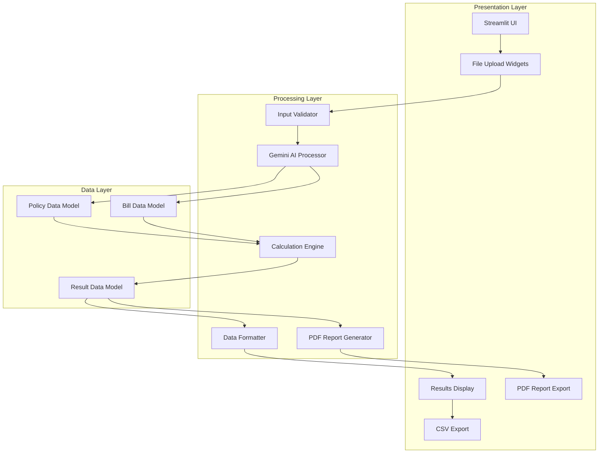

# Design Document: Medical Claims Processor

## Overview

The Medical Claims Processor is a Streamlit-based web application that automates medical reimbursement claim verification through AI-powered document analysis and deterministic financial calculations. The system processes insurance policy PDFs and medical bill documents using Google Gemini 1.5 Flash's multimodal capabilities, then applies precise mathematical logic to determine reimbursable amounts.

The architecture follows a clear separation of concerns: Streamlit handles the user interface, Gemini 1.5 Flash performs document extraction, and Pandas manages all financial calculations. This design ensures accuracy in financial computations while leveraging AI for complex document understanding tasks.

## Architecture

The system follows a three-layer architecture:



**Key Architectural Principles:**
- **Separation of Concerns**: UI, AI processing, and calculations are isolated
- **Deterministic Calculations**: All financial logic uses Python/Pandas, never AI
- **Multimodal AI Integration**: Leverages Gemini 1.5 Flash for document understanding
- **Cost Optimization**: Uses only free-tier services with efficient API usage

## Components and Interfaces

### 1. Streamlit UI Components

**File Upload Interface**
- Two side-by-side `st.file_uploader` widgets
- Policy uploader: accepts PDF files only
- Medical bill uploader: accepts PDF and image formats (JPG, PNG)
- File validation and error display

**Processing Interface**
- Primary "Process Claim" button with loading state
- Progress indicators during AI processing
- Error message display area

**Results Display Interface**
- Summary metrics cards (Total Billed, Approved Amount, Rejected Amount)
- Color-coded results table with conditional formatting
- CSV download button
- PDF report download button

### 2. AI Processing Module

**GeminiProcessor Class**
```python
class GeminiProcessor:
    def __init__(self, api_key: str)
    def process_documents(self, policy_file, bill_file) -> ClaimData
    def _create_extraction_prompt(self) -> str
    def _validate_response(self, response: dict) -> bool
```

**Key Features:**
- Handles both PDF and image file formats
- Uses structured prompts for consistent JSON extraction
- Implements response validation and error handling
- Optimizes API calls for free-tier usage

### 3. Calculation Engine

**ClaimCalculator Class**
```python
class ClaimCalculator:
    def calculate_reimbursement(self, claim_data: ClaimData) -> CalculationResult
    def _sum_covered_items(self, bill_items: List[BillItem]) -> float
    def _apply_copay(self, covered_total: float, copay_percentage: float) -> float
    def _calculate_rejected_total(self, bill_items: List[BillItem]) -> float
```

**Calculation Logic:**
- Uses Pandas for all mathematical operations
- Filters covered vs. rejected items using boolean indexing
- Applies copay percentage to covered amounts only
- Maintains audit trail of all calculations

### 4. Data Validation Module

**InputValidator Class**
```python
class InputValidator:
    def validate_file_format(self, file, allowed_types: List[str]) -> bool
    def validate_file_size(self, file, max_size_mb: int) -> bool
    def validate_gemini_response(self, response: dict) -> bool
```

### 5. PDF Report Generator

**PDFReportGenerator Class**
```python
class PDFReportGenerator:
    def __init__(self)
    def generate_report(self, claim_data: ClaimData, calculation_result: CalculationResult) -> bytes
    def _create_header_section(self, claim_data: ClaimData) -> None
    def _create_summary_section(self, calculation_result: CalculationResult) -> None
    def _create_details_table(self, calculation_result: CalculationResult) -> None
    def _format_currency(self, amount: float) -> str
```

**Key Features:**
- Generates professional PDF reports using reportlab library
- Extracts client details from policy information
- Creates formatted tables for claim results
- Includes summary metrics and detailed breakdowns
- Handles proper PDF formatting and styling

## Data Models

### ClaimData Model
```python
@dataclass
class ClaimData:
    policy_name: str
    copay_percentage: float
    bill_items: List[BillItem]
    client_name: Optional[str] = None
    policy_number: Optional[str] = None
    client_address: Optional[str] = None
    
    def to_dict(self) -> dict
    def from_json(cls, json_data: dict) -> 'ClaimData'
```

### BillItem Model
```python
@dataclass
class BillItem:
    description: str
    cost: float
    is_covered: bool
    rejection_reason: Optional[str] = None
    
    def to_dict(self) -> dict
```

### CalculationResult Model
```python
@dataclass
class CalculationResult:
    total_billed: float
    total_covered: float
    total_rejected: float
    copay_percentage: float
    approved_amount: float
    patient_responsibility: float
    bill_items_df: pd.DataFrame
    
    def to_csv(self) -> str
    def get_summary_metrics(self) -> dict
    def to_pdf_data(self) -> dict
```

### Gemini API Integration

**Structured Prompt Design:**
The system uses a carefully crafted prompt to ensure consistent JSON extraction:

```python
EXTRACTION_PROMPT = """
Analyze the provided insurance policy and medical bill documents.
Extract the following information and return ONLY valid JSON:

{
  "policy_name": "string - name of the insurance policy",
  "copay_percentage": number - percentage patient pays (0-100),
  "client_name": "string - policyholder's full name",
  "policy_number": "string - policy identification number",
  "client_address": "string - policyholder's address",
  "bill_items": [
    {
      "description": "string - item description",
      "cost": number - item cost in dollars,
      "is_covered": boolean - true if covered by policy,
      "rejection_reason": "string or null - reason if not covered"
    }
  ]
}

Requirements:
- Return ONLY the JSON object, no additional text
- Ensure all numbers are valid floats
- Set rejection_reason to null for covered items
- Extract client details from the policy document
- Be conservative with coverage decisions
"""
```

**File Processing:**
- PDFs and images are processed using Gemini's multimodal capabilities
- Files are sent as base64-encoded content with appropriate MIME types
- Response validation ensures JSON structure compliance

## Error Handling

### File Upload Errors
- Invalid file format detection and user feedback
- File size limit enforcement (200MB default)
- Empty file detection and handling

### AI Processing Errors
- API key validation and error messaging
- Gemini API timeout and rate limit handling
- Invalid JSON response detection and retry logic
- Malformed document handling

### Calculation Errors
- Division by zero protection in percentage calculations
- Invalid numeric data detection and sanitization
- Missing required fields validation

### User Experience Errors
- Clear error messages with actionable guidance
- Loading states during processing
- Graceful degradation when services are unavailable

## Testing Strategy

The testing approach combines unit testing for specific functionality with property-based testing for universal correctness guarantees.

### Unit Testing
- **File Upload Tests**: Validate file format checking and error handling
- **Data Model Tests**: Test serialization/deserialization and validation
- **UI Component Tests**: Verify Streamlit widget behavior and state management
- **Integration Tests**: Test end-to-end workflows with mock data

### Property-Based Testing
Property-based tests will use the `hypothesis` library to validate universal properties across many generated inputs. Each test will run a minimum of 100 iterations to ensure comprehensive coverage.

**Test Configuration:**
- Library: `hypothesis` for Python
- Minimum iterations: 100 per property test
- Each test tagged with: **Feature: medical-claims-processor, Property {number}: {property_text}**

## Correctness Properties

*A property is a characteristic or behavior that should hold true across all valid executions of a system—essentially, a formal statement about what the system should do. Properties serve as the bridge between human-readable specifications and machine-verifiable correctness guarantees.*

Based on the requirements analysis, the following properties ensure the system behaves correctly across all valid inputs:

### Property 1: File Format Validation
*For any* uploaded file, the system should accept only valid formats (PDF for policies, PDF/image for bills) and reject invalid formats with appropriate error messages.
**Validates: Requirements 1.2, 1.3, 1.4**

### Property 2: API Integration Consistency
*For any* pair of valid uploaded documents, when processing is triggered, the system should send both files to Gemini API with the structured prompt.
**Validates: Requirements 2.1, 2.2**

### Property 3: Response Structure Validation
*For any* response from Gemini API, the system should validate that it contains all required fields (policy_name, copay_percentage, bill_items) before proceeding with calculations.
**Validates: Requirements 2.3, 2.4**

### Property 4: Calculation Accuracy
*For any* valid claim data, the system should correctly calculate reimbursable amounts by summing only covered items, applying the copay percentage, and separately calculating rejected amounts.
**Validates: Requirements 3.2, 3.3, 3.4**

### Property 5: Results Display Completeness
*For any* processed claim, the system should display all required metrics (total billed, approved amount, rejected amount) and show all bill items with their coverage status and rejection reasons where applicable.
**Validates: Requirements 4.1, 4.2, 4.4**

### Property 6: Visual Feedback Consistency
*For any* claim results, rejected items should be visually distinguished (color-coded red) and approved/rejected amounts should be clearly differentiated in the display.
**Validates: Requirements 4.3, 4.5**

### Property 7: CSV Export Completeness
*For any* processed claim, the generated CSV should contain all bill items with required columns (description, cost, is_covered, rejection_reason) and include summary information.
**Validates: Requirements 5.2, 5.3, 5.4**

### Property 8: Error Handling Robustness
*For any* system error (file upload failure, API unavailability, rate limiting, invalid input), the system should handle it gracefully and provide specific, actionable error messages to users.
**Validates: Requirements 2.5, 6.2, 6.3, 6.4, 7.5**

### Property 9: Input Validation Completeness
*For any* user input, the system should validate it before processing and reject invalid inputs with clear feedback.
**Validates: Requirements 1.5, 6.4**

### Property 10: UI Feedback Consistency
*For any* system state change (file upload, processing start, completion), the system should provide appropriate visual feedback including file names, loading indicators, and status updates.
**Validates: Requirements 1.5, 6.5**

### Property 11: PDF Content Completeness
*For any* processed claim with client details, the generated PDF should contain all client basic details (name, policy number, address) extracted from the policy document.
**Validates: Requirements 8.2**

### Property 12: PDF Claim Data Inclusion
*For any* processed claim results, the generated PDF should include all claim results data in tabular format with proper formatting.
**Validates: Requirements 8.3, 8.7**

### Property 13: PDF Structure Consistency
*For any* generated PDF report, it should contain clearly defined sections for client information and claim details with proper formatting and organization.
**Validates: Requirements 8.4**

### Property 14: PDF Summary Metrics Inclusion
*For any* calculation result, the generated PDF should include all summary metrics (total billed, approved amount, rejected amount) in a clearly formatted section.
**Validates: Requirements 8.6**

## Testing Strategy

The testing approach combines unit testing for specific functionality with property-based testing for universal correctness guarantees.

### Unit Testing
- **File Upload Tests**: Validate file format checking and error handling with specific file types
- **Data Model Tests**: Test serialization/deserialization and validation with known data structures
- **UI Component Tests**: Verify Streamlit widget behavior and state management with mock interactions
- **Integration Tests**: Test end-to-end workflows with predefined test documents
- **API Integration Tests**: Test Gemini API integration with mock responses and error conditions
- **PDF Generation Tests**: Test PDF creation with specific client data and claim results

### Property-Based Testing
Property-based tests will use the `hypothesis` library to validate universal properties across many generated inputs. Each test will run a minimum of 100 iterations to ensure comprehensive coverage.

**Test Configuration:**
- Library: `hypothesis` for Python
- Minimum iterations: 100 per property test
- Each test tagged with: **Feature: medical-claims-processor, Property {number}: {property_text}**

**Property Test Implementation:**
- **Property 1**: Generate random file types and validate format checking
- **Property 4**: Generate random claim data and verify calculation accuracy
- **Property 7**: Generate random processed claims and verify CSV completeness
- **Property 8**: Generate various error conditions and verify error handling
- **Property 9**: Generate invalid inputs and verify validation behavior
- **Property 11**: Generate random client data and verify PDF content completeness
- **Property 12**: Generate random claim results and verify PDF data inclusion
- **Property 13**: Generate various claim scenarios and verify PDF structure consistency
- **Property 14**: Generate random calculation results and verify PDF summary metrics

### Testing Balance
- Unit tests focus on specific examples, edge cases, and integration points
- Property tests verify universal behaviors across all valid inputs
- Both approaches are complementary and necessary for comprehensive coverage
- Property tests catch edge cases that might be missed in unit testing
- Unit tests provide concrete examples of expected behavior

The dual testing approach ensures both specific functionality works correctly and universal properties hold across all possible inputs, providing confidence in system correctness and reliability.